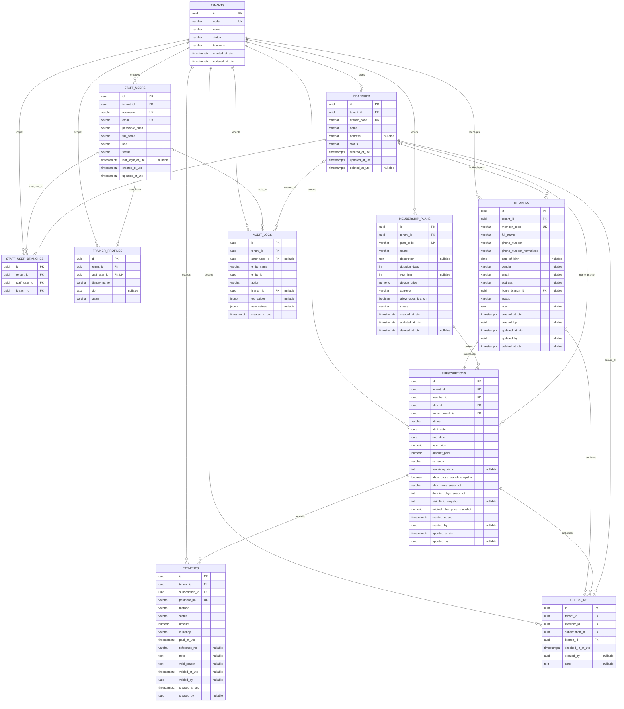

# Database Entity Relationship Diagram

## 1. Phạm vi

ERD này trực quan hóa database draft trong [Data Dictionary](./07-data-dictionary.md), bao gồm các bảng,
khóa chính, khóa ngoại trực tiếp và quan hệ chính của Gym SaaS MVP.

## 2. Chú thích

- `PK`: primary key.
- `FK`: foreign key được mô tả trực tiếp trong data dictionary.
- `UK`: unique key; với dữ liệu nghiệp vụ, constraint thực tế có thể là unique key ghép cùng
  `tenant_id` thay vì unique toàn hệ thống.
- `||`: bắt buộc đúng một; `o|`: không hoặc một; `o{`: không hoặc nhiều.
- Các quan hệ trực tiếp từ `tenants` thể hiện nguyên tắc mọi bảng nghiệp vụ đều được cô lập theo tenant.

## 3. Ràng buộc và lưu ý triển khai

- Các mã `member_code`, `plan_code`, `branch_code` và `payment_no` phải unique trong phạm vi tenant.
- `trainer_profiles.staff_user_id` là unique, nên một staff user có tối đa một trainer profile.
- `members.home_branch_id`, `audit_logs.actor_user_id` và `audit_logs.branch_id` là quan hệ tùy chọn.
- Các cột `created_by`, `updated_by` và `voided_by` đang được data dictionary mô tả là staff user id,
  nhưng chưa được tuyên bố rõ là foreign key bắt buộc. Vì vậy ERD giữ chúng như logical reference và
  chưa vẽ quan hệ vật lý tới `staff_users`.
- `audit_logs.entity_id` là polymorphic reference được xác định cùng `entity_name`, không phải foreign key
  vật lý tới một bảng duy nhất.
- ERD là bản thiết kế; `DbContext`, entity configuration và migration cần được tạo trước khi triển khai schema.
